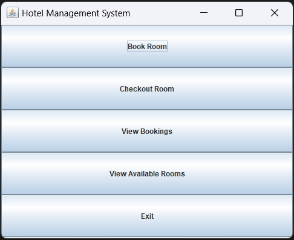
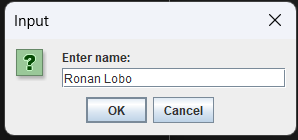
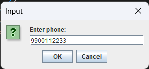
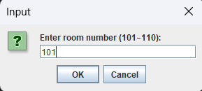
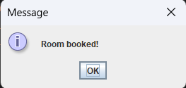
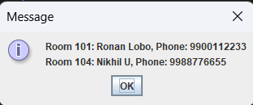
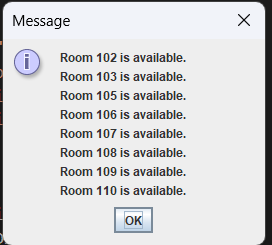

# 🏨 Hotel Management System (Java Swing)

A simple hotel management system built using Java Swing. Allows booking, checkout, and tracking of customers.

## 💻 Features
- Book a room (101–110)
- Checkout a customer
- View all bookings
- View available rooms
- Swing-based GUI

## 🧰 Tech Stack
- Java
- Java Swing (GUI)
- OOP Principles

## 🚀 Run Instructions

1. Open terminal in the `src` folder:
```bash
cd src
```

2. Compile all `.java` files:
```bash
javac *.java
```

3. Run the main program:
```bash
java Main
```

## 📸 Screenshots

### 🏠 Home Page
Landing screen with all primary operations like Book, Checkout, View Bookings, and Available Rooms.



---

### 🛏️ Booking Procedure

**Step 1: Enter Customer Name**  
User is prompted to enter the customer’s name.



**Step 2: Enter Phone Number**  
User enters a phone number.



**Step 3: Enter Room Number**  
Available room numbers (101–110) are entered.



**Step 4: Booking Confirmation**  
Dialog box confirms successful booking.



---

### 📋 View Booked Rooms
List of all customers and the rooms they have booked.



---

### ✅ View Available Rooms
Rooms that are currently unoccupied and available for booking.



## 🪪 License
MIT License